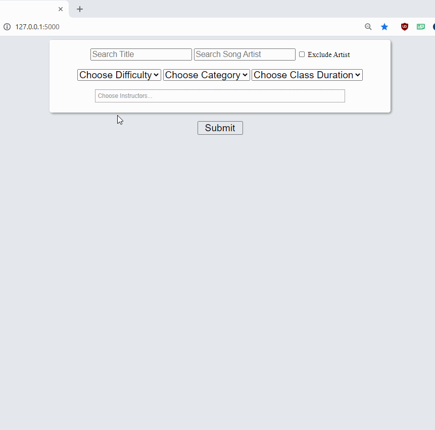

This [application](pel.nshah.org) is a simple, mobile-friendly search engine for Peloton cycling classes. It expands searching capabilities beyond the current scope of the Peloton search function, and allows for a user to easily setup bookmarks with pre-configured search parameters. 

The back end/database creation "PelotonCyclingScraper.py" application runs using the Peloton API in conjunction with a user-specific Peloton Session ID cookie to build a local MYSQL or mariadb server. MYSQL or mariadb must be loaded and setup prior to running the application. The MYSQL credentials and Peloton Session ID Cookie are loaded through a Settings.txt file that is auto-generated on the first execution of the Scraper or Flask App. 

Run the "PelotonCyclingScraper.py" to build the database. A 1 second timer was added between each Class API call to prevent a very high request rate, but that can be removed if desired. You can modify the limit in the 'workout_request_limit' variable to request a larger number of classes to build the database. A local copy of all the classes is currently downloaded for quick database rebuilds, but if a smaller local footprint is required, that function isn't necessary. 

Once the MYSQL database is built and running, you can run the Peloton_Flask_App.py to serve the search page at localhost:5000. 

